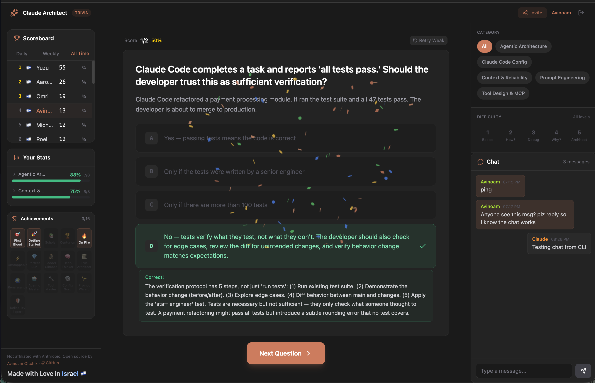

# Claude Architect Trivia

351 questions across 5 domains to test your Claude Code expertise.



## What is this?

An app that teaches you the technical fundamentals required to become a Claude Code Architect. The questions are based on Anthropic's official certification for Claude Architects (or rather, rumors of it).

Every answer — right or wrong — gives you deeper context and explanations, so you're actually learning, not just guessing.

## Features

- **351 questions** across 5 domains: Agentic Architecture, Tool Design & MCP, Claude Code Config, Prompt Engineering, Context & Reliability
- **5 difficulty levels** from "What is this?" to "Architect it" — auto-increases as you streak
- **Public leaderboard** — compete against others
- **Achievements** — unlock badges as you progress
- **Glossary tooltips** — hover underlined terms to learn definitions
- **Global chat** — discuss questions with other players

## Try it

**[claude-architect-trivia.onrender.com](https://claude-architect-trivia.onrender.com)**

## Tech Stack

- **Frontend:** React, TypeScript, Vite, Tailwind CSS
- **Backend:** Node.js, Express
- **Database:** MongoDB Atlas
- **Deployment:** Docker on Render

## Run locally

```bash
# Install dependencies
npm run install:all

# Start dev servers (client + server)
npm run dev
```

Requires a MongoDB instance. Set `MONGODB_URI` in `server/.env`.

## License

MIT

---

Made with Love in **Israel** 🇮🇱

By [Avinoam Oltchik](https://www.linkedin.com/in/avinoam1)
